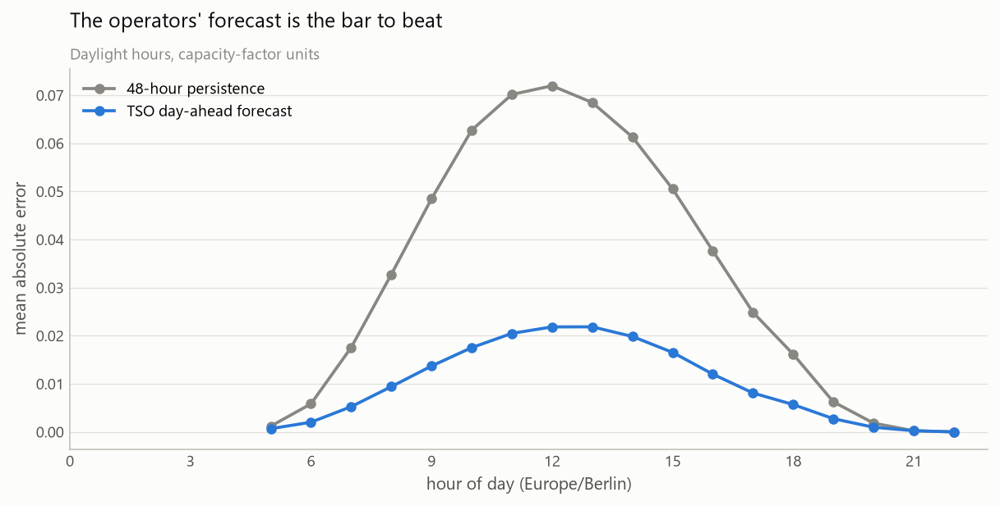
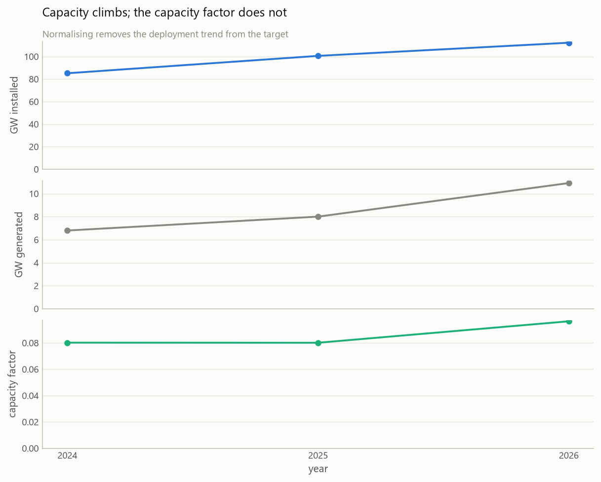

# SmartGrid-AI

Day-ahead forecasting and battery dispatch optimisation for the German
electricity market.

A household with rooftop PV, a heat pump, an EV and a battery has to decide each
hour whether to store energy, export it, or buy from the grid. Making that
decision well needs three forecasts — solar generation, consumption, and price —
and an optimiser that turns them into a schedule.

## What it does

```bash
python -m smartgrid.tomorrow          # forecast tomorrow, recommend a schedule
python -m smartgrid.tomorrow --save   # and persist it for later scoring
python -m smartgrid.score             # compare saved forecasts to what happened
```

A run for 2026-08-02, a 10 kWp array with a 10 kWh battery:

```
Cheapest power at 12:00, 13:00, 14:00; dearest at 19:00, 20:00, 21:00.
Charge from the grid around 12:00, 13:00, 14:00, 23:00.
Discharge around 00:00, 20:00, 21:00.
Solar peaks near 12:00 at 4.4 kW.
Expected benefit on 2026-08-02: EUR 2.09
  (1.75 from the battery, 0.33 from solar offsetting purchases).
```

Prices went **negative** that midday — down to −3.73 EUR/MWh — so the battery
charges while being paid to consume and discharges into the 186 EUR evening
peak. Tomorrow's prices are published rather than predicted: the auction clears
at noon the day before. The uncertain input is solar, which is what the model
supplies.

## Results

**Day-ahead solar forecast**, 19 walk-forward folds, 7,680 daylight hours,
capacity-factor units:

| Model | MAE | RMSE |
|---|---|---|
| Transmission operators' forecast | **0.0112** | 0.0170 |
| Gradient boosting | 0.0169 | 0.0250 |
| Ridge | 0.0252 | 0.0347 |
| Climatology | 0.0404 | 0.0596 |
| 48-hour persistence | 0.0404 | 0.0631 |

The benchmark is the forecast the transmission operators actually published, not
a naive baseline. This model reaches about two-thirds of their accuracy using
only free public data; they have plant-level registry data, operator telemetry
and multi-model ensembles.

Sampling weather at nine locations rather than one cut error by 43%. An ablation
showed the gain comes from the *national average* being a better estimate, not
from regional detail — removing the per-location columns costs only 4%.

**Battery dispatch**, 10 kWh / 5 kW home system trading day-ahead prices:

| Strategy | Revenue | Cycles/year |
|---|---|---|
| Perfect foresight | EUR 455/yr | 697 |
| Previous-day prices | EUR 370/yr | 697 |

Perfect foresight is an upper bound, not an achievable result. The EUR 85/year
gap is what a price forecast would be worth. The naive strategy cycles just as
hard for 19% less — it trades at the wrong times, not less often. Degradation is
not modelled, so check the cycle count against a warranty.

Dispatch is a mixed-integer program rather than a plain linear one. A pure LP
charges and discharges in the same hour whenever prices go negative: being paid
to consume makes it profitable to circulate energy and burn it as round-trip
losses. A binary per hour forbids it, for identical revenue and 12% fewer cycles.

## Pipeline

```
APIs / CSV
   │  ingestion (Python)
   ▼
BigQuery: raw
   │  transformation (SQLMesh)        clean → preprocess → features
   ▼
BigQuery: staging → marts
   │  modelling (Python, scikit-learn)
   ▼
forecasts → dashboard → battery optimiser
   │
   └─ saved to BigQuery, scored against measured output
```

SQL handles cleaning and feature engineering; Python handles ingestion and
modelling. BigQuery is the only warehouse, so there is one SQL dialect.

## Data sources

| Source | Provides |
|---|---|
| [Energy-Charts](https://api.energy-charts.info) (Fraunhofer ISE) | Day-ahead prices, generation by type, installed capacity, and the TSO's own day-ahead forecasts |
| [Open-Meteo](https://open-meteo.com/en/docs/historical-forecast-api) | Archived weather forecasts — temperature and direct/diffuse/shortwave radiation |
| [Open Power System Data](https://open-power-system-data.org) | Behind-the-meter household metering: PV, heat pump, EV |

Weather comes from archived *forecasts* rather than reanalysis, so features
reflect what was knowable when a forecast had to be issued.
`public_power_forecast` supplies the operational benchmark that models are
scored against.

## Exploratory analysis

Full notebook: [`notebooks/01_exploratory_analysis.ipynb`](notebooks/01_exploratory_analysis.ipynb).
Figures are regenerated by running it.

The benchmark this project is measured against — the transmission operators'
own published day-ahead forecast, against 48-hour persistence:



The operators' forecast is about three times more accurate than persistence, in
capacity-factor units over daylight hours. Beating a naive baseline means little
here; beating this is the actual target.

Why the target is a capacity factor rather than megawatts:



Installed capacity keeps climbing while the capacity factor does not. A model
trained on raw MW would learn the deployment trend and extrapolate it.

## Setup

```bash
python -m venv .venv
.venv/Scripts/activate          # Windows
# source .venv/bin/activate     # macOS / Linux

pip install -e ".[dev]"

cp .env.example .env            # then set GCP_PROJECT
```

BigQuery access requires a Google Cloud project and application default
credentials:

```bash
gcloud auth application-default login
```

## Development

```bash
pytest -m "not network"    # tests needing BigQuery or a live API skip themselves
ruff check .
```

Tests that need credentials or network are marked and skip when unavailable, so
a fresh clone is green without any setup. CI runs on 3.11, 3.12 and 3.13, and
separately checks the committed notebook is executed and error-free.

## Layout

```
src/smartgrid/
  config.py        paths, market constants, environment settings
  sources/         one module per data source
  warehouse/       BigQuery load and query helpers
  modelling/       features, forecasters, backtest, live prediction, scoring
  optimisation/    battery dispatch and the daily recommendation
  viz/             shared chart palette and styling
  ingest.py        fetch every source and load it into BigQuery
  forecast.py      run the walk-forward solar backtest
  tomorrow.py      forecast the coming day and recommend a schedule
  score.py         measure saved forecasts against what happened
  dispatch.py      run the battery revenue backtest
  dashboard.py     Streamlit app
transform/         SQLMesh project: staging and mart models, audits
notebooks/         exploratory analysis
docs/figures/      generated charts
tests/
data/              local cache, gitignored
```

Rebuild everything from source:

```bash
python -m smartgrid.ingest                     # APIs -> BigQuery raw
cd transform && sqlmesh plan --auto-apply      # staging + marts, with audits
```

Run the models and the dashboard:

```bash
python -m smartgrid.forecast                   # walk-forward solar backtest
python -m smartgrid.dispatch                   # battery revenue backtest
python -m smartgrid.tomorrow --save            # forecast and recommend
python -m smartgrid.score                      # measure saved forecasts
streamlit run src/smartgrid/dashboard.py       # interactive dashboard
```

Running daily is ingest → `sqlmesh plan` → `tomorrow --save`, after 13:00 market
time so the auction has published. A forecast needs generation history within 48
hours of the target day, so the ingest is not optional.

## Roadmap

- [x] Ingestion from three sources into BigQuery
- [x] Cleaning and preprocessing in SQLMesh, with audits
- [x] Feature engineering with gate-time discipline
- [x] Exploratory analysis
- [x] Day-ahead solar forecasting, backtested against the operators' forecast
- [x] Live prediction for the coming day
- [x] Battery dispatch optimiser and daily recommendation
- [x] Dashboard
- [x] Forecast persistence and live scoring
- [ ] Household consumption forecasting — OPSD data is ingested but not yet
      modelled; `plan.py` uses a fixed baseline load in its place
- [ ] Price forecasting — would close the EUR 85/year gap to perfect foresight

## Licence

MIT for project code. Each data source carries its own terms.
